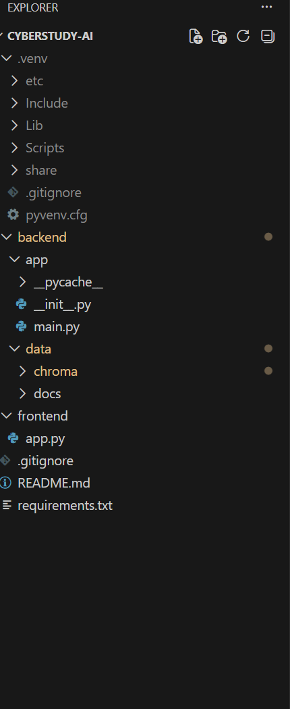

# 🛡️ CyberStudy AI - Local RAG Chatbot

Fully local cybersecurity study assistant built with FastAPI, Streamlit, Ollama, and ChromaDB.

<<<<<<< HEAD
A fully local cybersecurity study assistant built with FastAPI, Streamlit, Ollama, and ChromaDB.

\## Features

\- Chat with cybersecurity notes and lab writeups.

\- Multi-document RAG with source-aware answers.

\- Fully local AI using Ollama.

\- FastAPI backend for document ingestion and chat.

\- Streamlit frontend for a simple chat interface.

\## Tech Stack

\- FastAPI

\- Streamlit

\- Ollama

\- ChromaDB

\- Python

\## Demo

=======
## Features
- Chat with cybersecurity notes and lab writeups.
- Multi-document RAG with source citations.
- Local AI using llama3.2 and mxbai-embed-large.
- Upload new TXT documents through the API.
- Streamlit frontend with FastAPI backend.

## Live Demo
>>>>>>> f267f30 (Add professional README with badges, demo instructions, and architecture)

Run the backend in one terminal:

uvicorn backend.app.main:app --reload --port 8000
<<<<<<< HEAD

Run the frontend in another terminal:

=======
Run the frontend in a second terminal:
>>>>>>> f267f30 (Add professional README with badges, demo instructions, and architecture)

streamlit run frontend/app.py
<<<<<<< HEAD

Open in your browser:
=======
Then open:
>>>>>>> f267f30 (Add professional README with badges, demo instructions, and architecture)

http://localhost:8501
<<<<<<< HEAD

Screenshots

Streamlit Chat UI

Streamlit Chat

FastAPI Docs

=======
Screenshots
Streamlit Chat UI
Streamlit Chat

FastAPI Backend Docs
>>>>>>> f267f30 (Add professional README with badges, demo instructions, and architecture)
FastAPI Docs

Project Structure

<<<<<<< HEAD
!\[Folder Structure](Folder structure.png)

Architecture

=======
Architecture
>>>>>>> f267f30 (Add professional README with badges, demo instructions, and architecture)

Your Notes (.txt files)
        |
        v
ChromaDB Vector Store <-> Ollama Embeddings
        |
        v
FastAPI Backend (/chat)
        |
        v
Streamlit Frontend (localhost:8501)
<<<<<<< HEAD

=======
>>>>>>> f267f30 (Add professional README with badges, demo instructions, and architecture)
Project Structure

cyberstudy-ai/
├── backend/
│   ├── app/
│   │   ├── __init__.py
│   │   └── main.py
│   └── data/
│       ├── chroma/
│       └── docs/
├── frontend/
│   └── app.py
├── .gitignore
├── README.md
└── requirements.txt
<<<<<<< HEAD

Quick Start

=======
Quick Start
>>>>>>> f267f30 (Add professional README with badges, demo instructions, and architecture)

git clone https://github.com/plusive27-max/cyberstudy-ai.git
cd cyberstudy-ai
pip install -r requirements.txt
ollama pull llama3.2
ollama pull mxbai-embed-large
uvicorn backend.app.main:app --reload --port 8000
streamlit run frontend/app.py
<<<<<<< HEAD

Example Questions

=======
Example Questions
>>>>>>> f267f30 (Add professional README with badges, demo instructions, and architecture)
What is cybersecurity?

What is Wazuh?

How does ransomware work?

What are common cybersecurity threats?

<<<<<<< HEAD

Portfolio Value

=======
Portfolio Value
>>>>>>> f267f30 (Add professional README with badges, demo instructions, and architecture)
Shows full-stack development with FastAPI and Streamlit.

Demonstrates local AI and RAG workflow skills.

<<<<<<< HEAD

Fits a cybersecurity portfolio project well.

Can be extended with PDFs, Docker, and more models.

Future Improvements

=======
Fits a cybersecurity portfolio because it works with study notes and lab writeups.

Can be extended with PDFs, Docker, or more models later.

Future Improvements
>>>>>>> f267f30 (Add professional README with badges, demo instructions, and architecture)
Add PDF and DOCX support.

Add chat history.

Add Docker setup.

Add better source formatting.

Add model selection in the UI.

<<<<<<< HEAD

Built by plusive27-max as a cybersecurity and AI portfolio project.

=======
Built by plusive27-max as a cybersecurity and AI portfolio project.
>>>>>>> f267f30 (Add professional README with badges, demo instructions, and architecture)
